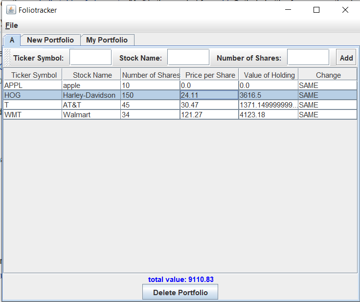

# FolioTracker

## Summary
The aim of this project is to implement an application program for tracking the contents and value of stock portfolios. The Folio Tracker discovers current stock values by querying a stock quote server (http://www.tickertech.com). The graphical user interface (GUI) and the back-end are fully decoupled and follow the MVC model.

## Functionality
* Manage multiple portfolios
* Create and delete portfolios
* See the positions (stock name, number of shares held, price per share, and value of the holding) in a portfolio
* Add and remove stocks to the portfolio
* Increase and decrease the number of shares of a stock
* Refresh the stock prices
* See the total value of a portfolio
* Save portfolio information to disk
* Indicate whether price is going up or down (Change)
* Estimate gains and losses for a particular stock by taking into account the price at which share were bought and sold
	
## To run the app:
Run ./src/app/Main.java

## Screenshot

